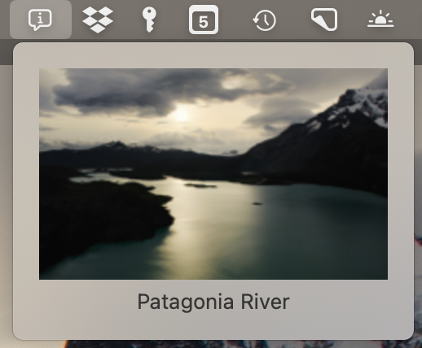

# WallpaperInfo

Silly little Mac menu bar app to display the current aerial wallpaper description.

I wrote this because MacOS doesn't show you the name of the aerial screensaver locations,
unlike AppleTV.

## Installation

Requirements: MacOS Sonoma 14.0 or later

[Download the current release](https://github.com/bgreenlee/WallpaperInfo/releases/latest/download/WallpaperInfo.zip)
and just run it (you might want to stick it in your Applications folder). It will add a new icon () to the menu bar at the top of your screen. Clicking on it will show a preview image and name of the current aerial wallpaper.

Note that this app won't do much for you if you're not using the aerial wallpapers.

## License

[MIT](LICENSE) &copy;2024 by Brad Greenlee
